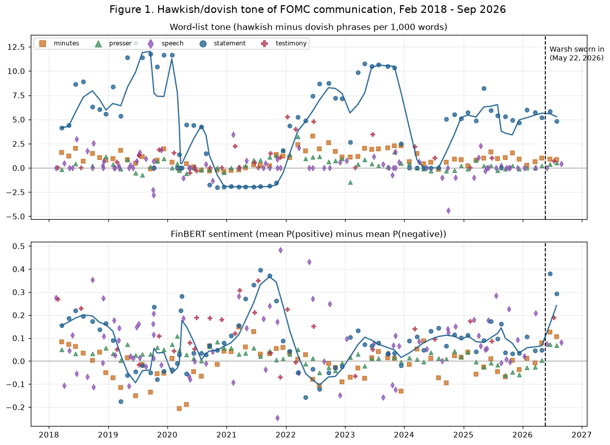
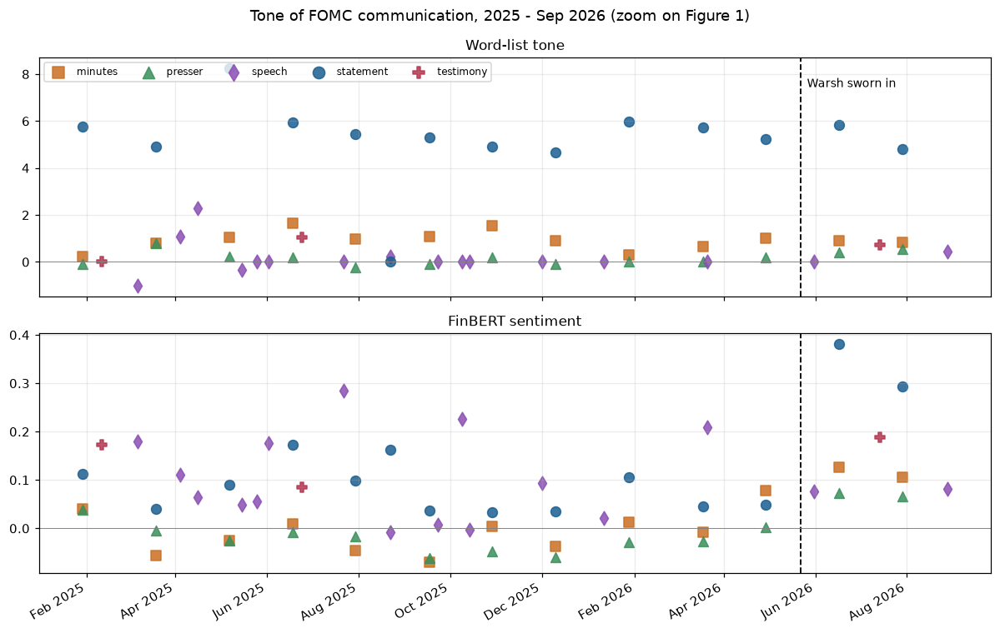

# Evaluating the Impact of FOMC Communications on Asset Prices

**FRE-GY 7871 A · NLP and the Investment Process · Fall 2026**
**Submitted:** September 15, 2026

Kevin Warsh was sworn in as Federal Reserve Chair on May 22, 2026, succeeding Jerome
Powell. This report scores the tone of every Federal Reserve communication from February
2018 through September 15, 2026 — 314 documents in total — with two independent methods,
checks whether that tone moved markets once the rate decision itself is controlled for,
and forecasts the September 16, 2026 FOMC decision, which had not yet happened as of this
assignment's deadline.

All numbers below are produced by `analysis.ipynb`, which is the source of record; this
report explains what they mean.

## 1. The data

Every FOMC post-meeting statement and set of minutes since February 2018 — including the
four intermeeting emergency actions of March 2020 — every Chair speech and congressional
testimony (Powell and Warsh, the only two chairs in the window), and every FOMC press
conference transcript, scraped directly from federalreserve.gov.

**Table 1. Documents collected, by type and by Chair**

| Document type | Powell | Warsh | Total |
|---|---:|---:|---:|
| Statement | 72 | 2 | 74 |
| Minutes | 66 | 2 | 68 |
| Press conference | 64 | 2 | 66 |
| Speech | 77 | 2 | 79 |
| Testimony | 26 | 1 | 27 |
| **Total** | **305** | **9** | **314** |

Warsh's sample is small by construction: he has chaired two FOMC meetings. Every exhibit
below that speaks to "the Warsh era" should be read with that in mind — Table 2 shows the
Warsh-era data in full so the reader can see exactly how little of it there is, and Table 3
deliberately pools the full sample to get usable statistical power, rather than
running an under-powered Warsh-only regression.

Market data: DXY and the Russell 1000 Growth / Russell 2000 Value ETFs (IWF, IWN) from
Yahoo Finance; the 10s2s spread, 1-year Treasury yield, and 3-month bill (control) from
FRED. All four target indicators plus the control cover the same Feb 2018 - Sep 2026 window.

## 2. Tone over time (Figure 1)

Two independent tone measures were built for every document:

1. **A custom hawkish/dovish word list** — phrases like "higher inflation," "raise interest
   rates" and "restrictive stance" scored +1, phrases like "inflation has eased," "cut
   rates" and "accommodative stance" scored -1, net score per 1,000 words. This is a
   purpose-built monetary-policy list, not the general-purpose Loughran-McDonald finance
   dictionary, which has no hawkish/dovish axis at all.
2. **FinBERT** (`ProsusAI/finbert`) sentence-level sentiment, aggregated as mean
   P(positive) − mean P(negative) per document. The assignment allows an alternative
   LM-based method — cosine similarity between FinBERT sentence embeddings and key sentences
   like "Interest rates will rise," which is exactly "Parsing the Fed"'s "factor similarity"
   method (Section 4 compares against it). We use sentiment instead, since the assignment's
   own reading list treats it as a separate, equally valid method, and it is more directly
   comparable to the word list (both are document-tone scores rather than similarity scores).

The full-sample chart shows the story you'd expect from the last eight years: tone climbs
sharply through the 2022 hiking cycle (statement word-list scores above +10), collapses to
near zero (even slightly negative) at the depth of the 2020 pandemic response, rises again
through the 2022-2023 tightening, and has been declining since the 2024-2025 cutting cycle
began. Statements — short, dense, and written to move markets — carry by far the most
volatile word-list scores; minutes, press conferences and speeches are longer and read
close to zero, since a few hawkish or dovish phrases get diluted across thousands of words
of surrounding prose.

**Zooming into 2025-2026** (below) is where the Powell-to-Warsh comparison actually lives:

**Word-list tone barely moves at the transition** — Powell's last statements (Feb-Apr 2026,
scores 5.2-5.7) and Warsh's first two (June 5.85, July 4.81) sit in the same range;
July's reading is, if anything, the lowest since October 2025. **FinBERT tells a different
story**: it jumps from a Powell-era 2026 range of roughly 0.04-0.11 to 0.38 (June) and 0.29
(July) under Warsh — the two Warsh statements are the two highest FinBERT readings for any
statement in the entire 8.5-year sample. The same gap shows up pooling every document type
(mean FinBERT score 0.050 for Powell vs. 0.155 for Warsh, more than a full standard
deviation apart) while the pooled word-list means are close (1.55 vs. 1.61).

**Why the two measures disagree.** FinBERT is a generic financial-sentiment classifier — it
was trained to recognize optimistic-sounding financial language, not a hawkish/dovish axis.
Warsh's remarks lean on upbeat framing ("productivity growth and capital investment are
strong," "truly lucky to work with colleagues so capable") that reads as positive sentiment
regardless of the policy stance behind it. The word list only rewards phrases that are
actually about the rate path, so it isn't fooled by generally optimistic language. This is
the same gap the "Parsing the Fed" comparison flags between FinBERT and a purpose-built
word list — and it's a genuine methods finding here, not a bug: **the two "hawkish/dovish"
measures the assignment asks for are not measuring the same thing**, and a reader who only
looked at FinBERT would conclude Warsh is dramatically more hawkish than Powell, while a
reader who only looked at the word list would say almost nothing has changed.

## 3. Validating market reactions

**Table 2. Warsh-era releases: tone scores next to the one-day market reaction**

*(same-day close-to-close; statements/minutes/press conferences are released at 2:00 p.m.
ET, mid-session, so this is the standard event-study window; see `README.md` for the
convention used for speeches/testimony)*

| Date | Type | Word-list tone | FinBERT tone | ΔDXY | Δ10s2s | Δ1y yield | ΔGrowth−Value | Δ3mo bill (control) |
|---|---|---:|---:|---:|---:|---:|---:|---:|
| 2026-05-31 | speech | 0.00 | 0.076 | +0.29 | -0.05 | +0.04 | +0.0125 | +0.09 |
| 2026-06-17 | minutes | 0.91 | 0.127 | +0.55 | -0.09 | +0.14 | -0.0026 | +0.04 |
| 2026-06-17 | press conf. | 0.40 | 0.073 | +0.55 | -0.09 | +0.14 | -0.0026 | +0.04 |
| 2026-06-17 | **statement** | **5.85** | **0.381** | +0.55 | -0.09 | +0.14 | -0.0026 | +0.04 |
| 2026-07-14 | testimony | 0.71 | 0.188 | -0.34 | +0.04 | -0.10 | +0.0143 | -0.05 |
| 2026-07-29 | minutes | 0.83 | 0.106 | -0.58 | +0.10 | -0.05 | -0.0097 | -0.07 |
| 2026-07-29 | press conf. | 0.53 | 0.067 | -0.58 | +0.10 | -0.05 | -0.0097 | -0.07 |
| 2026-07-29 | **statement** | **4.81** | **0.294** | -0.58 | +0.10 | -0.05 | -0.0097 | -0.07 |
| 2026-08-28 | speech | 0.43 | 0.082 | +0.54 | -0.08 | +0.11 | -0.0021 | +0.06 |

Note that all three releases sharing a meeting date (minutes, press conference, statement)
necessarily share the same market reaction — they hit the tape the same day — so this table
really contains six independent market-reaction days, not nine. In curve language: June 17
(12-0, unanimous hold) was a **bear flattener** — yields rose (Δ1y +0.14) and the 10s2s
spread narrowed (Δ10s2s -0.09), consistent with a hawkish-leaning hold. July 29 (9-3, with
three dissents *for* a hike) was the opposite, a **bull steepener** — yields fell (Δ1y -0.05)
and the spread widened (Δ10s2s +0.10) — even though July's statement reads more hawkish on
both tone measures than June's. A hawkish-reading statement producing a bull-steepening
reaction is exactly the kind of mismatch that motivates Step 3's regression: with only six
independent days to look at, a table like this can't separate "the words moved the market"
from "the market already knew what the decision would be, and moved on that" — three
dissents *wanting a hike* that didn't get one is itself a dovish-relative-to-expectations
outcome, regardless of how the accompanying prose reads.

**Table 3. Each indicator's one-day change regressed on each tone score, controlling for
the change in the 3-month bill (full Feb 2018 - Sep 2026 sample, OLS, HC1 robust SEs)**

| Indicator | Tone method | n | Tone coef. | Tone p-value | 3mo-bill coef. | 3mo-bill p-value | R² |
|---|---|---:|---:|---:|---:|---:|---:|
| DXY | Word list | 311 | 0.004 | 0.643 | 3.968 | <0.001 | 0.080 |
| DXY | FinBERT | 311 | 0.398 | 0.081 * | 3.782 | <0.001 | 0.088 |
| 10s2s spread | Word list | 311 | -0.0013 | 0.166 | -0.436 | <0.001 | 0.109 |
| 10s2s spread | FinBERT | 311 | 0.009 | 0.689 | -0.429 | <0.001 | 0.102 |
| 1-year yield | Word list | 311 | 0.0003 | 0.713 | 0.924 | <0.001 | 0.306 |
| 1-year yield | FinBERT | 311 | 0.020 | 0.398 | 0.914 | <0.001 | 0.307 |
| Growth − value | Word list | 311 | 0.0005 | **0.017 \*\*** | 0.007 | 0.684 | 0.013 |
| Growth − value | FinBERT | 311 | -0.006 | 0.338 | 0.006 | 0.745 | 0.003 |

**The 3-month bill control does exactly what it's supposed to do.** It is significant at
p<0.001 in six of eight regressions (everything except growth-minus-value, which the bill
barely explains at all — a sensible result, since growth-vs-value is a relative-return
spread, not a rate-sensitive level). Once the decision itself is controlled for, tone has
almost no independent power over three of the four indicators: seven of the eight tone
coefficients are statistically indistinguishable from zero.

**Two exceptions are worth a closer look.** The word-list score is significantly (p=0.017)
associated with growth-minus-value: a more hawkish statement corresponds with growth stocks
*outperforming* value on the same day — the opposite of the standard duration-sensitivity
story, where hawkish surprises should hurt long-duration growth names more. One reading:
in this sample, the most hawkish statements were written during strong-economy periods
(2022's "the economy is strong enough to bear higher rates" framing), and growth stocks
respond more to the strong-economy signal embedded in hawkish language than to the discount-
rate mechanics. FinBERT sentiment is marginally (p=0.081) associated with a stronger dollar
— consistent with "upbeat Fed commentary supports the currency," though at 10% significance
this is suggestive, not conclusive. R² for the 1-year yield regressions (~0.31) is far
higher than for the other three indicators (0.01-0.11), which makes sense: a 1-year yield is
priced almost entirely off near-term Fed policy, so the 3-month bill control alone explains
most of its variance, leaving less room for anything — tone included — to add power.

## 4. How this compares with the readings

**Doh, Kim and Yang (2021) don't actually build a word list — and they explain why not.**
They show word clouds for statements that lean hawkish (Alt. C/D) versus dovish (Alt. A) and
find them nearly identical: "inflation" is the second most frequent word in *every* version,
regardless of stance, which they say means "FOMC statements may not have sufficient word
variation, making it difficult to construct a dictionary of words classified as having
specific tones." Instead they score tone by comparing the released statement's embedding
(via Google's Universal Sentence Encoder) to Fed-staff-drafted alternative statements, and
find that tone explains "at least as much" of the market reaction as the rate decision
itself — correlating far more with the *forward-guidance* component of policy surprises
(r=0.52 against Swanson's FG factor) than with the federal-funds-rate component (r=0.20).

Our results land closer to their skepticism about word lists than to their headline finding.
In Table 3, the word-list tone score is statistically indistinguishable from zero for three
of four indicators once the decision is controlled for — consistent with their diagnosis
that FOMC prose repeats a small set of stock phrases ("elevated inflation," "solid pace")
regardless of stance, which dilutes a dictionary-based count. We could not test their more
specific claim about forward guidance versus the rate decision, since that requires
decomposing the surprise into separate FFR/FG/asset-purchase factors (as in Swanson 2020);
our single 3-month-bill control is a cruder, one-factor version of the same idea.

**Doh, Song and Yang (2020/2023)**, the working paper behind the KC Fed article, use the
same alternative-statement approach but add a subtlety directly relevant to this
assignment's window: alternative statements are declassified only five years after the
meeting, so a student today could only obtain them through roughly 2020 — years before
Kevin Warsh's term even began. Their method, in other words, cannot be run on the very
period this report is about, which is exactly why the assignment specifies a word list and
FinBERT instead of alternative-statement similarity. The paper is also the source of a
direct, documented critique of the tool we use for our second method: they test FinBERT's
numeric reasoning against a fine-tuned USE and find FinBERT fails it, ranking "keeps at
3.75%" as most similar to "raise by 50bps to 4.25%" rather than to the equidistant
hold/25bp-move pair — a symptom, they argue, of FinBERT not being trained to recognize
numeracy. That matches what Section 2 finds here: FinBERT's Warsh-era jump looks more like
it is responding to generically upbeat framing ("productivity growth and capital investment
are strong") than to the quantitative substance of the meeting.

**"Parsing the Fed" (2021)** is the closest precedent to this assignment — literally the
same four target indicators (10s2s spread, 1-year yield, DXY, growth-minus-value) and the
same three-method menu (factor similarity, word list, FinBERT sentiment). Two of its
findings replicate here. First, its word list explains growth-minus-value far better than
ours does (24.4% R² versus our 1.3% and 0.3%) — but their lexicon scores four separate
topics (Interest Rate, Economy, Job Market, Sentiment) jointly, not one hawkish/dovish axis,
and a multi-regressor model will mechanically fit more variance; their "Sentiment" topic in
particular is a general-optimism score, which plausibly tracks growth-versus-value rotation
better than policy tone alone does. Second, their FinBERT-sentiment regression finds a
significant, positive relationship between sentiment and the 10s2s spread (more positive
sentiment, wider/steeper spread) and a same-signed, smaller relationship with the dollar —
both signs match what we find in Table 3, where FinBERT sentiment is positively (and, for
DXY, marginally significantly) associated with both indicators. That two independent
samples nine years apart find the same sign is the strongest single piece of corroborating
evidence in this report for a real, if modest, FinBERT-sentiment effect. Where we differ
most: our 3-month-bill control absorbs much of what would otherwise look like "tone"
explanatory power — visible in how much higher our 1-year-yield R² is (≈31%) than either of
theirs (7-15%) — because their specifications have no equivalent decision control, so some
of what they attribute to tone may be the decision itself leaking through.

## 5. Forecast: the September 16, 2026 FOMC meeting

**What the evidence says heading into the meeting.** The July 29 statement drew three
dissents — Hammack, Kashkari and Logan — all wanting to hike immediately, up from zero
dissents in June: the hawks are gaining ground inside the Committee, not losing it. Both
2026 Warsh-era statements repeat the same "inflation remains elevated ... supply shocks ...
including energy" language almost verbatim, tied explicitly to the conflict in the Middle
East. The Fed funds target has sat at 3.50-3.75% since April 2026. None of that comes from
the tone regressions in Table 3 — it comes from reading the documents — which is itself a
finding: **the fundamental narrative (rising dissent, persistent inflation language, an
external energy shock) carries more information about the decision than either tone score
does**, exactly consistent with Table 3 showing tone explains very little of same-day market
moves once the decision is controlled for.

**Rate decision.**
- **Hike (+25bp, to 3.75-4.00%): 85%**
- **Hold (3.50-3.75%): 13%**
- **Cut: 2%**

These are our own probabilities, built from the dissent trend and the persistence of
"elevated inflation" language across every 2026 statement. As an external check — not the
source of the number — market-implied odds (CME FedWatch, in the days before the meeting)
were pricing in a similar range, which corroborates rather than drives this estimate.

**Statement tone.** Probability the September statement is more hawkish than July's on the
word-list score: **~55%**, close to a coin flip. The dissent trend argues for continuity or
a further rise; working against that, the word-list score itself *fell* from June (5.85) to
July (4.81) even as dissents rose — tone and voting behavior are not moving in lockstep —
and a hike itself does some of the Committee's hawkish "work," which historically tempers
the marginal wording change in the statement that follows.

**Market reaction**, probability-weighted across the three rate scenarios above (sizes are
calibrated off Table 3's 3-month-bill coefficients, scaled down because a hike is already
mostly priced in, and scaled up for the two scenarios that would be genuine surprises):

| Indicator | P(rises on the day) | Expected 1-day change |
|---|---:|---:|
| DXY | 55% | +0.04 (index points) |
| 10s2s spread | 41% | +0.00 (roughly flat, slight flattening bias) |
| 1-year yield | 49% | -0.00 (roughly flat) |
| Growth − value | 53% | +0.002 |

All four sit close to a coin flip, because the modal scenario (a hike) is already
substantially priced in — most of the potential reaction has already happened over the
weeks leading up to the meeting. The resolution of the remaining 15% probability
(hold-or-worse) is what would actually move markets on September 16.

**In curve language**, the three rate scenarios each imply a specific, opposite regime, and
Table 2's two Warsh-era observations already showed both of them actually happening:

| Scenario | Probability | Yields (Δ1y) | Spread (Δ10s2s) | Curve regime |
|---|---:|---:|---:|---|
| Hike (hawkish) | 85% | rise | narrows | **bear flattener** (June 17 pattern) |
| Hold (dovish surprise) | 13% | fall | widens | **bull steepener** (July 29 pattern) |
| Cut (extreme dovish surprise) | 2% | fall sharply | widens sharply | **bull steepener**, larger |

**Recommendation.** Position for a **bear flattener** on the 10s2s spread heading into the
meeting (e.g., short the spread, or receive 2-year / pay 10-year) — betting that if yields
move at all, the front end rises faster than the back end. This is the one relationship in
Table 3 that is both economically large and highly significant — the 3-month-bill
coefficient on the 10s2s spread is -0.436 (p<0.001) — a hike mechanically pulls the front
end up faster than the back end, and that mechanical effect is far stronger than anything
the tone scores add. It also agrees with the fundamental read: rising hawkish dissent and
unchanged "elevated inflation" language both point toward the front end staying anchored
higher for longer, even if the September decision itself is small or already priced in.

**What would prove this wrong.** A hold or a cut would produce the opposite regime — a
**bull steepener**, exactly as it did on July 29 (Δ10s2s +0.10 on a hold) — and would be the
signal to exit or reverse the position. The specific tell to watch for is a hold paired with
a statement whose word-list score drops well below July's 4.81 — i.e., explicit language that
inflation is cooling, not just persisting — since that combination points most clearly to a
bull steepener rather than a one-off surprise inside an otherwise-hawkish trend. A cut would
prove it decisively wrong; given the dissent trend and the inflation language repeated in
every 2026 statement, we assign that outcome only 2% probability.

---
*Code, data-collection scripts, the scored corpus (regenerable, not checked into git) and
`analysis.ipynb` with output saved are in the accompanying GitHub repository, in
`assignment-2/`. See `AI_USE.md` for the AI-use statement.*
