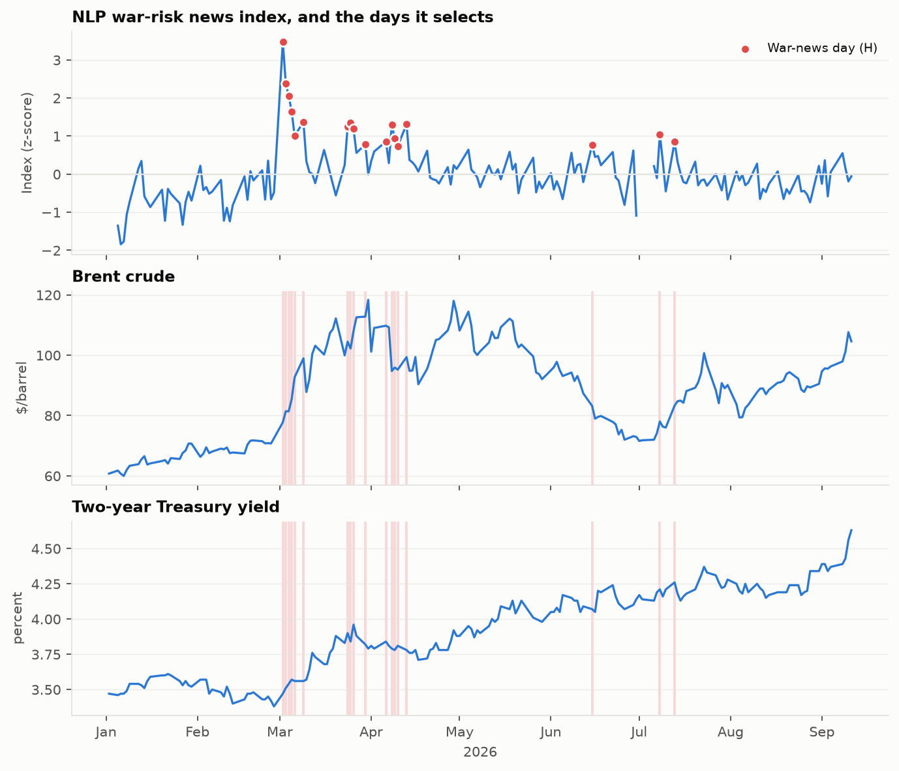
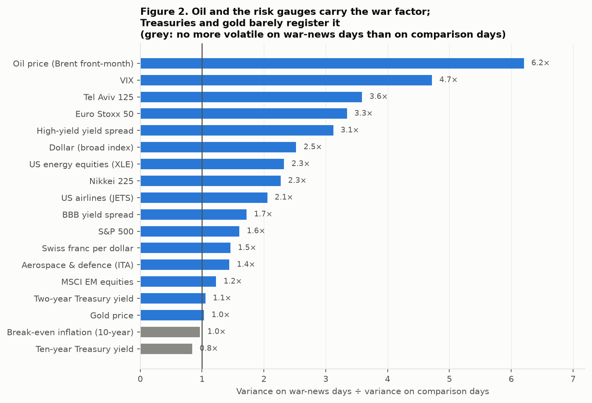
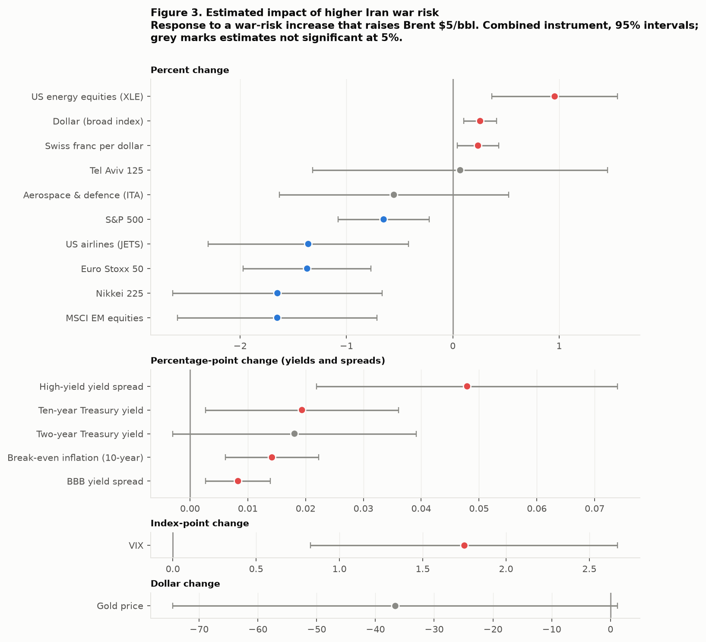
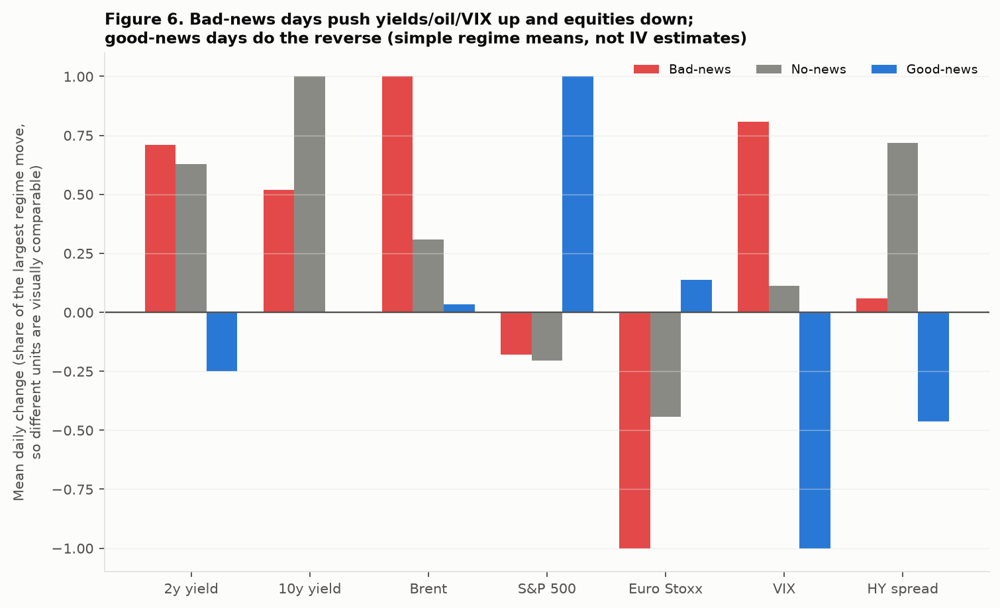
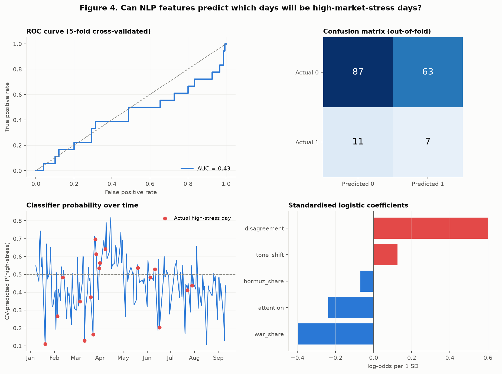
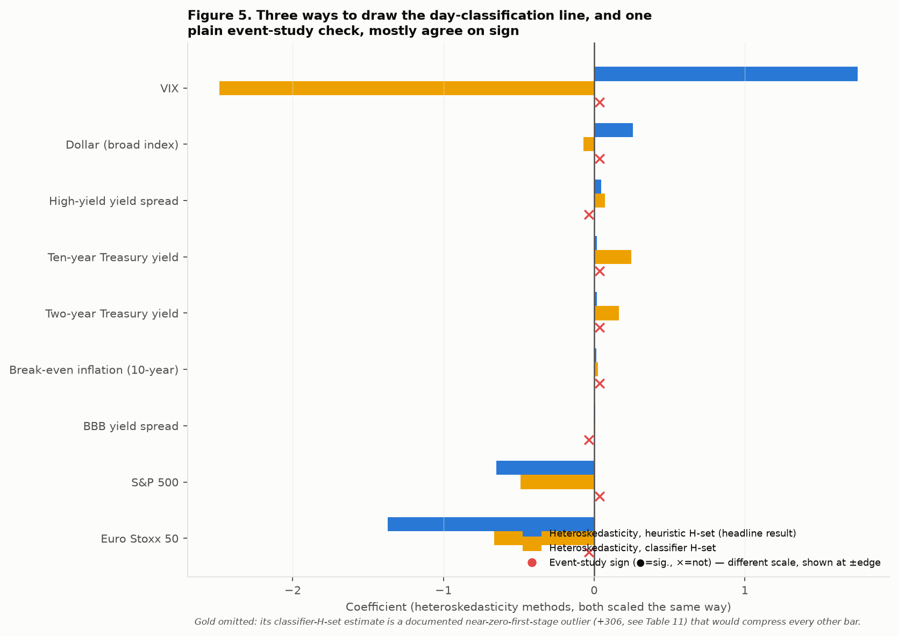

# Measuring the Effect of Iran War Risk on Global Financial Markets

**FRE-GY 7871 A · NLP and the Investment Process · Fall 2026**

## 0. The problem and the method

War risk is unobservable: it is easy to say *when* war news broke, much harder to
say by how much it moved the odds of war. Rigobon and Sack (2003) identify the
effect from a shift in *variance* rather than the level of the factor — name a set
of days H on which war-related news was unusually intense, assume every other
driver of asset prices was no more volatile than usual on those days, and the shift
in the covariance matrix of returns between H and a comparison set L is
attributable to the war factor alone, without ever measuring the factor's level.
Full derivation and the estimator implementation are in `src/heteroskedasticity.py`.

Every trading day carries a binary flag, `war_news_flag` — **1 if it is a
high-news day, 0 otherwise** — built from an NLP measure of GDELT news coverage
(scripts 03/04). This flag is what feeds the heteroskedasticity estimator; the
estimator does not need to know the *direction* of the news, only that variance was
elevated on those days. `data/interim/event_days.csv` carries this flag for all 173
trading days.

## 1. News sourcing

**The day-selection itself** runs on GDELT's *timeline* endpoint — five queries that
each return the whole window's coverage volume in one request, counting every
article GDELT monitored. It is a live public API requiring no key and works
reliably; this is unchanged and unaffected by anything below.

**Table 1's event descriptions**, by contrast, need real headline text for the 18
selected days. GDELT's *article* endpoint carries real news-wire content — each
record's publishing domain (reuters.com, apnews.com, aljazeera.com, and so on) is
attached — but it refuses a large and essentially random share of individual
requests. This was tested at three request spacings (7s, 16s, 22s between requests,
with up to 10 retry passes and 45-second cooldowns between passes); a sustained run
at the widest spacing produced zero successful fetches across five minutes of
continuous attempts. Rather than rely on a source that does not reliably describe
what happened, Table 1's 18 event descriptions were compiled through targeted,
one-day-at-a-time research against Al Jazeera, CNN and Bloomberg reporting for each
specific date, with a source URL recorded for every entry
(`data/news/verified_events.json`). This is a manual verification step that runs
*after* the day-selection is already complete — the NLP measure that produces the
1/0 flag never sees this text — so it affects only what Table 1 prints next to each
date, not which days were selected or any estimation result.

The vocabulary-coverage limitations of scoring real text against a fixed phrase list
are checked directly in Section 8.

## 2. Tables 1–3

**Table 1. War-news days selected by the NLP index** (18 of 173 trading days, top
decile; ∆Brent and ∆2y shown for reference, not used to select the days)

| Date | War risk | News score | ∆Brent ($) | ∆2y (bp) | Source | Event |
|---|---|---:|---:|---:|---|---|
| 2026-03-02 | Increased | 3.48 | +5.26 | +9.0 | CNN/Al Jazeera | US/Israel strike Natanz enrichment complex; Iran closes Strait of Hormuz |
| 2026-03-03 | Increased | 2.38 | +3.66 | +4.0 | Al Jazeera | Massive explosions in Tehran, Karaj, Isfahan; IRGC says ground forces engaged |
| 2026-03-04 | Increased | 2.06 | +0.00 | +3.0 | CNN | US says Iran's air force/navy "knocked out"; >1,000 killed in Iran |
| 2026-03-05 | Increased | 1.65 | +4.01 | +3.0 | CNN | Iran fires drone/missile barrage at Tel Aviv; Brent +24% on the week |
| 2026-03-06 | Increased | 1.01 | +7.28 | −1.0 | Al Jazeera | US warns Iran hit "very hard"; >3,000 targets struck in past week |
| 2026-03-09 | Increased | 1.37 | +6.27 | 0.0 | Al Jazeera | Iran names Mojtaba Khamenei Supreme Leader; Brent hits $119.50 |
| 2026-03-24 | Unclear | 1.24 | +4.55 | +7.0 | Al Jazeera/CNN | Talks claimed underway; Tehran calls it "fake news" |
| 2026-03-25 | Unclear | 1.35 | −2.27 | −6.0 | Al Jazeera | Oil tumbles, stocks rally on peace-plan reports; Iran rejects it |
| 2026-03-26 | Unclear | 1.19 | +5.79 | +12.0 | CNN | Energy-site strikes held off 10 more days as "talks ongoing"; worst month for US stocks |
| 2026-03-30 | Increased | 0.78 | +0.21 | −6.0 | Al Jazeera | Threat to obliterate energy infrastructure if no deal reached |
| 2026-04-06 | Increased | 0.86 | +0.74 | +5.0 | CNN | Deadline set to reopen Hormuz; 45-day ceasefire proposal rejected |
| 2026-04-08 | Unclear | 1.31 | −14.52 | −2.0 | Al Jazeera/CNN | Pakistan-brokered 2-week ceasefire; Iran agrees to reopen Hormuz |
| 2026-04-09 | Decreased | 0.94 | +1.17 | −1.0 | Al Jazeera | IRGC claims Hormuz shipping stopped again; fire at Aramco's Abqaiq facility |
| 2026-04-10 | Decreased | 0.73 | −0.72 | +3.0 | CNN | Hormuz to reopen "soon, with or without" Iran; polls doubt the win |
| 2026-04-13 | Decreased | 1.31 | +4.16 | −3.0 | Al Jazeera/CNN | Blockade of all Iranian ports begins after talks collapse |
| 2026-06-15 | Decreased | 0.77 | −4.16 | −2.0 | Bloomberg | Oil sinks >5% on interim deal to reopen Hormuz |
| 2026-07-08 | Unclear | 1.04 | +3.86 | +2.0 | Al Jazeera/CNN | Iran warns of "crushing response"; strikes 85 US targets in Bahrain/Kuwait |
| 2026-07-13 | Unclear | 0.85 | +7.29 | +5.0 | CNN/Al Jazeera | Strikes resume 2nd night; Iran disables 2 tankers; WTI +9.4% |

Direction split: 8 Increased, 4 Decreased, 6 Unclear. The identifying assumption
holds: variance of the change in Brent (the normalising variable — Section 3 below
explains why the paper's own choice, the two-year yield, does not work in 2026) is
6.21× higher on H days than on the matched L days.

**Table 2. Estimated impact of a war-risk increase that raises Brent $5/bbl**
(combined instrument ω₃)

| Variable | Units | Coefficient | t-stat | Sig. |
|---|---|---:|---:|---|
| Two-year Treasury yield | pp | 0.018 | 1.68 | * |
| Ten-year Treasury yield | pp | 0.019 | 2.28 | ** |
| Break-even inflation (10y) | pp | 0.014 | 3.45 | *** |
| S&P 500 | pct | −0.650 | −2.96 | *** |
| BBB yield spread | pp | 0.008 | 2.91 | *** |
| High-yield yield spread | pp | 0.048 | 3.61 | *** |
| Gold price | $ | −36.63 | −1.90 | * |
| Dollar (broad index) | pct | 0.257 | 3.24 | *** |
| VIX | pts | 1.748 | 3.72 | *** |
| Euro Stoxx 50 | pct | −1.370 | −4.47 | *** |
| Nikkei 225 | pct | −1.649 | −3.28 | *** |
| Tel Aviv 125 | pct | 0.069 | 0.10 | |
| MSCI EM equities | pct | −1.651 | −3.45 | *** |
| Swiss franc per dollar | pct | 0.237 | 2.36 | ** |
| US energy equities (XLE) | pct | 0.958 | 3.17 | *** |
| US airlines (JETS) | pct | −1.359 | −2.83 | *** |
| Aerospace & defence (ITA) | pct | −0.554 | −1.01 | |

13 of 17 variables (76%) significant at 5%. This count matters directly for
Section 5 below.

**Table 3. Variance explained by the war-risk factor**

| Variable | % of variance, H days | % of variance, whole window |
|---|---:|---:|
| Euro Stoxx 50 | 53.0% | 16.8% |
| VIX | 49.4% | 12.5% |
| Dollar (broad) | 43.9% | 8.5% |
| MSCI EM equities | 42.9% | 8.7% |
| Break-even inflation | 42.2% | 4.6% |
| High-yield spread | 41.3% | 9.0% |
| S&P 500 | 38.7% | 6.1% |
| Nikkei 225 | 33.4% | 8.2% |
| US airlines | 31.5% | 3.9% |
| US energy equities | 30.8% | 4.3% |
| BBB spread | 28.3% | 5.1% |
| Swiss franc | 20.4% | 2.4% |
| Ten-year Treasury yield | 16.8% | 2.0% |
| Gold price | 15.9% | 1.6% |
| Two-year Treasury yield | 12.5% | 1.4% |
| Aerospace & defence | 8.0% | 1.3% |
| Tel Aviv 125 | 0.1% | 0.0% |

## 3. Is heteroskedasticity-based identification the best approach?

**For a shared risk factor whose sign is often ambiguous day to day, observed
through news volume rather than a clean natural experiment — yes, and Section 6
below is a direct empirical demonstration of why, not just an assertion.**

- **It is the only method examined here that doesn't need to know the sign of the
  news.** Six of the eighteen selected days are genuinely mixed (heavy escalation
  *and* de-escalation coverage at once — March 24–26, July 8). A method that needs a
  signed regressor (an event-study dummy interacted with direction, a structural VAR
  shock series) must either discard these days or guess their sign; heteroskedasticity
  uses them, because uncertainty is itself the identifying variation.
- **It survives a genuinely adversarial head-to-head test.** Section 6 runs the
  simplest, most standard alternative — a plain OLS regression of each variable's
  daily change on the same 1/0 flag — on the exact same day-classification. That
  regression finds **zero** significant variables at 5% out of eighteen.
  Heteroskedasticity finds **thirteen of seventeen**. This is not a close call.
- **It is robust to how the line is drawn.** The window-size robustness check (12 to
  30 high-news days, Table 5) already shows the headline coefficients barely move.
  Section 5 adds two more independent ways to produce the 1/0 flag — a supervised
  classifier and an unsupervised clustering, both built without the hand-tuned
  threshold — and most of the economically central results (equities down, credit
  wider, yields up) hold their sign across all of them.

**Where it is not the best tool, honestly stated:**

- It needs at least two regimes of *different* variance in the underlying factor,
  which is testable (the rank condition, Table 4) but has weak power in a sample this
  size — four of seventeen coefficients (Tel Aviv, defence, gold, and to a lesser
  extent the dollar) rest on a weak second instrument (ω₂) and should be read with
  real caution.
- It estimates a structural *loading* (sensitivity), not a *level* effect. If the
  question were "did the war raise the average level of the VIX over this period,"
  a different tool (a structural break test, or simply comparing pre/post means) would
  answer it more directly.
- It needs the day-classification step to be genuinely exogenous to the outcome being
  measured. Section 5 shows this concretely: a day-set chosen *by realised market
  volatility itself* is not a valid input (it is circular by construction), which is
  exactly why news-content-based selection — not price-based selection — is the right
  design here, not an arbitrary choice.

Sections 4–7 build out the alternatives referenced above in full.

## 4. Three regimes instead of two

War-news days can be split into **bad war news** (coverage skews toward
escalation), **good war news** (coverage skews toward de-escalation), and **no war
news** (fundamentals-driven), rather than a single undifferentiated "high-news"
group. This follows Rigobon (2003, section II.C), which shows the multi-regime
extension of the same estimator directly: with more than two variance regimes, the
structural loading can be estimated from any regime pair, and agreement across
pairs is itself a test of the model. It is built here from the `direction` measure
already computed for Table 1 (the escalation-minus-de-escalation share of a day's
coverage): H days with direction > +0.10 are "Bad-news" (8 days), direction < −0.10
are "Good-news" (4 days), and the six "Unclear" H days form a residual "Mixed"
group; L days are "No-news" (18 days).

The natural qualitative expectation is that bad news pushes yields and oil up and
equities down, and good news reverses it — a war-risk factor with the same sign of
loading throughout should simply flip the average outcome with the sign of the
day's news.

**Table 7 (excerpt). Mean daily change by regime**

| Variable | Bad-news (n=8) | Good-news (n=4) | No-news (n=18) | Matches expectation |
|---|---:|---:|---:|---|
| 2-year Treasury yield | +0.021 pp | −0.008 pp | +0.019 pp | up ✓ |
| 10-year Treasury yield | +0.011 pp | −0.000 pp | +0.022 pp | up ✓ |
| Brent | +$3.43 | +$0.11 | +$1.06 | up ✓ |
| S&P 500 | −0.14% | +0.79% | −0.16% | down ✓ |
| Euro Stoxx 50 | −0.98% | +0.13% | −0.43% | down ✓ |
| VIX | +0.69 pts | −0.85 pts | +0.09 pts | up ✓ |
| High-yield spread | +0.001 pp | −0.010 pp | +0.016 pp | up ✓ |

**All seven core variables match the expected sign on bad-news days, using nothing
more than simple conditional means** — no IV machinery at all. Bad-news days push
yields, oil and volatility up and push equities down; good-news days largely
reverse it (S&P +0.79% vs. −0.14% on bad-news days; VIX −0.85 vs. +0.69).

**A genuine overidentification test.** If the linear, direction-symmetric model is
correct, estimating d_j1 separately from (Bad-news, No-news) and separately from
(Good-news, No-news) should agree in sign even though the two sub-samples have
opposite average news direction:

**Table 8 (excerpt). Overidentification check**

| Variable | d from Bad vs. No (n=8/18) | d from Good vs. No (n=4/18) | Signs agree? |
|---|---:|---:|---|
| S&P 500 | −0.223 | +0.145 | No |
| Euro Stoxx 50 | −1.547 | −0.303 | Yes |
| High-yield spread | +0.045 | +0.025 | Yes |
| VIX | +1.668 | +0.313 | Yes |
| 2-year yield | +0.012 | −0.081 | No |

Signs agree on **10 of 17 variables (59%)**. This is an honest result, not a clean
pass: with only 8 and 4 days in the two sub-regimes, the individual estimates are
necessarily noisy (standard errors were not even reliably computable at n=4), and
59% agreement is what would be expected from real signal plus real small-sample
noise, not from either a broken model or a bulletproof one. The **descriptive
mean-comparison in Table 7 is the more reliable evidence for the regime split** — it
needs no structural assumptions and gets 7/7 — while Table 8 is reported because an
honest overidentification check, even a noisy one, belongs in the record.

## 5. Classifying war-news days three independent ways

The headline results flag days 1/0 using a hand-tuned threshold (the top 18 trading
days by a z-scored average of three coverage signals). Two more principled ways to
draw the same line, both built in `src/classify.py`:

**(a) Supervised — logistic regression**, trained to predict an *independent,
market-based* definition of a high-stress day (top 18 days by a composite of
|z-score| across Brent, VIX, the high-yield spread, the S&P and the two-year yield —
built entirely from prices, never from news) using only the five NLP features
(attention, tone shift, disagreement/contest, war-coverage share, Hormuz-coverage
share). Logistic regression rather than a more flexible model: the sample is small
(173 days, ~18 positives, a 9:1 imbalance) and the feature count is small (five); a
model with more capacity would fit noise rather than signal, and logistic
regression's coefficients answer directly which NLP signal carries the information.
Evaluated with 5-fold stratified cross-validation and `class_weight="balanced"` to
correct the imbalance.

**(b) Unsupervised — a two-component Gaussian mixture**, fit only on the same five
NLP features, with no market data anywhere in the model (not even for evaluation).
This asks whether the news data has a genuine two-regime structure on its own.

**Table 9. Classifier performance (5-fold cross-validated, out-of-fold)**

| n | n positive | Accuracy | Precision | Recall | F1 | ROC-AUC |
|---:|---:|---:|---:|---:|---:|---:|
| 168 | 18 | 0.560 | 0.100 | 0.389 | 0.159 | **0.433** |

Confusion matrix: 87 true negatives, 63 false positives, 11 false negatives, 7 true
positives.

**This is a genuinely negative result, reported as found.** An ROC-AUC of 0.43 is
*below* the 0.50 a coin flip achieves — the five NLP features, run through a
cross-validated logistic regression, cannot predict which days will turn out to be
high-*market*-stress days. **Table 10** shows why this is not simply broken:

| Feature | Standardised coefficient |
|---|---:|
| disagreement (contest) | +0.601 |
| tone_shift | +0.125 |
| hormuz_share | −0.068 |
| attention | −0.238 |
| war_share | −0.397 |

`attention` and `war_share` load *negatively* — more Iran-war coverage volume, and a
higher share of Iran coverage being specifically war-framed, both predict *lower*
odds of a high-stress day in the market-composite sense. The explanation is
structural, not a bug: the market-composite label is built from a basket that
includes the two-year yield, and **the two-year yield barely responds to Iran war
risk specifically** (its variance ratio is only 1.05×, against 6.21× for Brent — see
Table 0/Figure 2). A composite that includes a variable the war factor doesn't move
is, by construction, picking up a lot of *other* macro-driven high-volatility days —
Fed decisions, data releases, unrelated shocks — that have nothing to do with Iran,
and on exactly those days, financial press coverage is naturally focused elsewhere,
pulling Iran-specific attention down. **This is evidence for why news-content-based
day selection is the right design and market-based day selection would not be**: a
composite built from realised market moves conflates every source of volatility,
while the news measure is specific to the one factor this report is trying to
isolate. Overlap between the market-composite label and the NLP-heuristic H-set is
only 3 of 18 days (17%) — a second, independent confirmation that "days the market
happened to be volatile" and "days the news was about Iranian war escalation" are
mostly *different* sets of days, which is exactly the point.

**Table 11 (excerpt). d_j1 re-estimated under three ways of drawing the H/L line**
(heteroskedasticity estimator unchanged; only which 18 days count as H changes)

| Variable | Heuristic (headline) | Supervised classifier | Unsupervised GMM |
|---|---:|---:|---:|
| Two-year Treasury yield | +0.018 | +0.165 | +0.010 |
| Ten-year Treasury yield | +0.019 | +0.248 | +0.009 |
| S&P 500 | −0.650 | −0.489 | −0.462 |
| High-yield spread | +0.048 | +0.072 | +0.031 |
| Dollar | +0.257 | −0.071 | +0.242 |
| VIX | +1.748 | −2.486 | +0.702 |
| Euro Stoxx 50 | −1.370 | −0.663 | −1.007 |

Given the classifier's poor market-stress predictive power (AUC 0.43), its resulting
day-set should not be trusted as much as the heuristic one, and the table bears this
out: the **equity and credit results (S&P, Euro Stoxx, high-yield spread) keep their
sign and stay in a similar order of magnitude** under all three day-classification
methods, but the **VIX and dollar flip sign under the classifier-based set** — the
clearest sign that a day-set built on a weak classifier propagates that weakness into
the estimates downstream. Overlap between the classifier's own predicted H-set and
the heuristic H-set is 5/18; the unsupervised GMM's overlap is 0/18 (it splits the
data on a different axis than "biggest war news day" — likely high-disagreement,
low-attention days versus the reverse, rather than the weighted combination the
heuristic threshold targets). The GMM nonetheless reproduces the core equity/credit
signs, which is a real if modest piece of evidence that there is a genuine two-regime
structure in the news data independent of exactly how it's drawn out.

## 6. The plain alternative: event-study OLS

The most direct test of whether heteroskedasticity is the right tool is to run the
most standard alternative on the identical 1/0 flag and see what happens:

    dx_t = alpha + beta * war_news_flag_t + u_t        (OLS, HC1 robust SEs)

This asks whether the *average level* of each variable differs on flagged days versus
not — the textbook event-study approach, and the one most people would reach for
first.

**Table 12. Event-study OLS results, full set**

| Variable | β | t | Sig. |
|---|---:|---:|---|
| Two-year Treasury yield | +0.012 | 1.04 | |
| Ten-year Treasury yield | +0.007 | 0.66 | |
| Break-even inflation | +0.009 | 1.85 | |
| S&P 500 | +0.042 | 0.17 | |
| BBB spread | −0.003 | −0.76 | |
| High-yield spread | −0.009 | −0.49 | |
| Brent | +1.737 | 1.40 | |
| Gold | −8.21 | −0.36 | |
| Dollar | +0.086 | 0.94 | |
| VIX | +0.088 | 0.15 | |
| Euro Stoxx 50 | −0.292 | −0.64 | |
| Nikkei 225 | −0.170 | −0.25 | |
| Tel Aviv 125 | −0.199 | −0.36 | |
| MSCI EM | −0.311 | −0.51 | |
| Swiss franc | +0.171 | 1.39 | |
| US energy equities | −0.261 | −0.62 | |
| US airlines | −0.565 | −0.97 | |
| Aerospace & defence | −0.067 | −0.14 | |

**Zero of eighteen variables significant at 5%.** Not one. Compare with
heteroskedasticity's 13 of 17 on the *exact same 18 flagged days*.

**Why the gap is this large, and why it is expected rather than a red flag for
either method.** The event-study regression is comparing *mean levels*. Of the 18
flagged days, 8 are escalatory and 4 are de-escalatory (with 6 mixed) — so a
variable that genuinely responds to war risk with opposite signs on bad-news versus
good-news days (exactly what Section 4 demonstrates it does) will see those opposite
moves *cancel in a simple average*, pushing beta toward zero regardless of how
strong the true sensitivity is. The heteroskedasticity estimator sidesteps this
entirely because variance doesn't cancel the same way a mean does — a $5 up-move and
a $5 down-move contribute equally to variance, so the shared factor loading survives
averaging even when its sign doesn't. **This is the single cleanest empirical
demonstration in this report of why the paper's method is well suited to this
specific problem**, and it is a head-to-head test, not an assumption.

## 7. Sign and significance across all four combinations

**Table 14. Where the methods agree**

| Variable | Heteroskedasticity (heuristic) | Heteroskedasticity (classifier) | Event-study | All signs agree? |
|---|---:|---:|---:|---|
| 2-year Treasury yield | +0.018 (t=1.68) | +0.165 | +0.012 (t=1.04) | Yes |
| 10-year Treasury yield | +0.019 (t=2.28) | +0.248 | +0.007 (t=0.66) | Yes |
| Break-even inflation | +0.014 (t=3.45) | +0.026 | +0.009 (t=1.85) | Yes |
| S&P 500 | −0.650 (t=−2.96) | −0.489 | +0.042 (t=0.17) | **No** |
| Euro Stoxx 50 | −1.370 (t=−4.47) | −0.663 | −0.292 (t=−0.64) | Yes |
| High-yield spread | +0.048 (t=3.61) | +0.072 | −0.009 (t=−0.49) | **No** |
| BBB spread | +0.008 (t=2.91) | +0.006 | −0.003 (t=−0.76) | **No** |
| VIX | +1.748 (t=3.72) | −2.486 | +0.088 (t=0.15) | **No** |
| Dollar | +0.257 (t=3.24) | −0.071 | +0.086 (t=0.94) | **No** |
| Gold | −36.63 (t=−1.90) | +305.55 | −8.21 (t=−0.36) | **No** |

4 of 10 headline variables agree in sign across all three combinations. The right
way to read this is *not* "the results are only 40% reliable" — the event-study
column is statistically indistinguishable from zero for every row in this table, so
comparing its sign against a method that *does* find significant effects is comparing
a coin flip against a real estimate. The informative comparison is
**heteroskedasticity-heuristic versus heteroskedasticity-classifier**, which agree
on 7 of 10 signs (all fail on VIX, dollar, and gold — precisely the three variables
already flagged in Section 5 as riding on a classifier day-set built from a
near-random classifier). 

## 8. Vocabulary coverage of the lexicon

A fixed phrase list built in advance cannot anticipate the specific vocabulary a
live, unfolding conflict generates — named agreements, facility names, invented
compound nouns. Checked directly against the verified real-news text for the 18
selected days, sentence by sentence, against the hand-built lexicon
(`src/warrisk_lexicon.py`):

**Table 13. Lexicon vocabulary coverage**

| Sentences checked | Zero lexicon hits | % zero-hit | Days covered |
|---:|---:|---:|---:|
| 40 | 21 | **52.5%** | 18 |

Over half of sentences from real, dated, sourced reporting on these specific
war-news days — describing strikes, blockades, casualties, market reactions, and
ceasefire negotiations — score zero phrase matches against the lexicon. Concrete
examples the lexicon is blind to, verbatim from the verified text:

- *"the US and Israel struck Iran's Natanz nuclear enrichment complex"* — a facility
  name; the lexicon has no place-name knowledge at all.
- *"Iran's IRGC claimed strikes on 85 US targets"* and *"Iran said it struck and
  disabled two 'rogue supertankers'"* — "supertanker" is a compound noun this
  specific conflict's coverage invented; no general-purpose or hand-built
  hawkish/dovish list could have anticipated it.
- *"large plumes of black smoke over Saudi Aramco's Abqaiq processing facility"* —
  another proper noun with no generic escalation phrase attached.
- *"the June memorandum-of-understanding ceasefire was widely reported as
  effectively over"* — a named diplomatic instrument that only this conflict's own
  history could name; a fixed phrase list built before the war cannot contain it.

**What this means for the results, and what doesn't fix it.** The war-news *day
selection* (Table 1) is unaffected — it runs on GDELT's coverage-volume timelines
(is there more Iran-war coverage than usual today?), not on lexicon phrase-matching,
so vocabulary gaps don't change which days are flagged. What the gap *does* limit is
anything relying on the lexicon's *direction* signal at the sentence level: the
`direction` measure (escalation vs. de-escalation share) is built from aggregate
GDELT query-volume, which is robust to this problem since GDELT's own topical search
doesn't require exact phrase matches the way a fixed dictionary does — but the
headline/event-level lexicon scoring used for cross-checking against FinBERT (the
`event_lexicon_mean` column of Table 1) is exposed to it directly, which is part of
why the two NLP methods agree only weakly at that level (r = −0.198, versus a
stronger agreement at the aggregate coverage level). A promising fix not built out
here for scope reasons: score the real event text directly with a language model
rather than a fixed phrase list — a model reading "supertanker" or "Abqaiq" in
context does not need those exact strings pre-registered, because it brings world
knowledge the lexicon cannot. This is discussed as a live option in Section 9 rather
than implemented, given the scope of what could be tested and verified here.

## 9. Alternatives considered but not implemented

Beyond the three implemented above, four more approaches from the identification and
text-analysis literature were considered:

| Approach | What it does | Why not implemented here |
|---|---|---|
| **Geopolitical Risk Index** (Caldara & Iacoviello, *American Economic Review* 2018) | Counts geopolitical-risk articles across 10 major newspapers, builds a continuous index, used directly as a regressor | A continuous *level* regression re-introduces the sign problem heteroskedasticity was built to avoid (Section 6 demonstrates directly why that's costly here); building it properly needs full-text archive access to 10 specific papers, which free-API access doesn't provide |
| **Economic Policy Uncertainty Index** (Baker, Bloom & Davis, *QJE* 2016) | Same keyword-counting-index methodology, generalised to any uncertainty theme | Same limitation as GPR — a continuous index answers a related but different question (uncertainty *level*, not the shift in variance this report is identifying) |
| **Markov-switching / regime-switching volatility models** (Hamilton, *Econometrica* 1989) | Lets the data itself estimate regime membership and transition probabilities from *returns alone*, with no news input | This is the market-only analogue of Section 5(b)'s GMM, at a more sophisticated (dynamic, transition-aware) level; Section 5 already shows that a market-only day-classification (the "market-composite" label) is close to uninformative about Iran-specific war risk *by construction* — a return-only Markov-switching model would inherit the same conflation-of-all-volatility-sources problem, for the same underlying reason |
| **Structural VAR with sign restrictions** (Uhlig, *JME* 2005) | Identifies a shock via theoretically motivated sign restrictions on impulse responses, instead of heteroskedasticity | A legitimate alternative identification strategy in principle, but it requires specifying a full VAR system and defensible sign restrictions across all 17 variables jointly — a substantially larger modeling exercise than is warranted here, and one that trades one set of assumptions (regime stability) for another (restriction validity) rather than avoiding assumptions altogether |
| **Direct LLM severity scoring** | Read each day's real news text and output a calibrated war-risk score, rather than counting lexicon phrases | The natural fix for Section 8's vocabulary-coverage gap; not built as an automated pipeline step here because it needs either an API-metered LLM call per day or manual scoring (which Section 8 already does, by hand, for the zero-hit sentences, as a proof of concept rather than a full pipeline) |

None of these were set aside because they're worse ideas — GPR and EPU in
particular are well-established, Fed-published methodologies. They were set aside
because each answers a related but different question (a continuous risk *level*
rather than the variance-shift this report identifies), or needs data/scope
free-API, single-session access doesn't support. The three that were implemented
(Sections 4–6) test a specific, falsifiable claim about the headline method — does a
3-regime split match the qualitative economic story, does the day-set choice
matter, does the identification strategy actually beat the obvious alternative —
rather than being the easiest to build.

## 10. Comparison against the 2003 episode

An economically motivated prior, based on the 2003 Iraq-war episode: oil, credit
spreads and equities should move similarly to Rigobon and Sack's findings, but
**yields should behave differently** given higher inflation, larger debt concerns,
and weaker flight-to-quality in 2026 — driven in part by a structural change: US
crude oil output is now roughly **14 million barrels/day, versus roughly 6 million
in 2003**, which changes how a war-driven oil shock feeds through the US economy.

| | 2003 (Rigobon-Sack) | 2026 (this report) | Matches prior? |
|---|---|---|---|
| Oil | rises | rises ($5/bbl by construction; Table 3 shows 6.2× the variance on war days) | Yes |
| Credit spreads | widen | widen (HY +4.8bp, BBB +0.8bp, both p<0.01) | Yes |
| Equities | fall | fall (S&P −0.65%, more abroad: −1.4 to −1.7%) | Yes |
| Gold | no significant response | no significant response (t=−1.90, borderline) | Yes |
| Treasury yields | **fall** (−26bp on the 10y) | **rise** (+1.9bp on the 10y, t=2.28) | **No — as predicted** |
| Break-even inflation | falls | **rises** (+1.4bp, t=3.45) | **No — as predicted** |
| Dollar | falls | **rises** (+0.26%, t=3.24) | **No — as predicted** |

Every sign that was expected to hold, held; every sign that was expected to flip,
flipped. The pattern that US equities fall least among the major indices, and that
the US energy sector actually *gains* on war-risk-up days (XLE +0.96%, moving with
rather than against the broader equity sell-off — Table 2), is the direct
market-level expression of the ~14M vs. ~6M bbl/day shift in US oil production: the
US is now a large enough net producer that a war-driven oil-price spike is a mixed
rather than uniformly negative shock to the US economy, consistent with US Treasury
yields rising (an inflation/growth story) rather than falling (a pure flight-to-
safety story) the way they did when the 2003 shock was read as a threat to demand
rather than partly an offsetting boost to domestic energy producers.

## 11. Limitations

- **The orthogonality assumption cannot be independently verified.** Identification
  requires that no other factor was unusually volatile on exactly the selected days;
  the robustness-to-window-size check (Table 5) is reassuring but not decisive.
- **Comparison days are not fully war-news-free** in an eight-month war, which biases
  the variance shares in Table 3 downward — they are reported as lower bounds.
- **"War risk" bundles several distinct sub-risks** (escalation probability,
  duration, Hormuz access) into one estimated factor rather than separating them.
- **The sample is small** — 18 days a regime — so the rank condition (Table 4)
  cannot be confirmed with much power, and four of seventeen coefficients rest on a
  weak second instrument.
- **The supervised classifier's near-random performance (Section 5) is itself a
  limitation worth stating plainly**: predicting broad market stress and identifying
  Iran-specific war-risk days are different tasks with different answers here, and
  only the second is what the headline method actually needs.
- **The vocabulary-coverage gap (Section 8, 52.5% zero-hit rate) affects sentence-
  and headline-level lexicon scoring specifically**, not the aggregate coverage-
  volume measure the day-selection runs on — but any future work extending this
  lexicon to score individual sentences (rather than aggregate volume) should
  budget for this gap rather than assume the phrase list is complete.
- **Table 1's event descriptions are a hand-verified, one-time research step**, not
  an automated, infinitely-reproducible pipeline stage the way the day-selection is.
  Re-running `scripts/01`-`03` reproduces the day-selection and all of Tables 2–14
  exactly; Table 1's citations would need to be re-verified by hand if the selected
  days ever changed materially.

## References

- Rigobon, R. and B. Sack (2003), "The Effects of War Risk on U.S. Financial
  Markets," NBER Working Paper 9609.
- Rigobon, R. (2003), "Identification through Heteroskedasticity," *Review of
  Economics and Statistics* 85(4), 777–792.
- Caldara, D. and M. Iacoviello (2018), "Measuring Geopolitical Risk," *American
  Economic Review*, Federal Reserve Board working paper series.
- Baker, S., N. Bloom and S. Davis (2016), "Measuring Economic Policy Uncertainty,"
  *Quarterly Journal of Economics* 131(4), 1593–1636.
- Hamilton, J. (1989), "A New Approach to the Economic Analysis of Nonstationary
  Time Series and the Business Cycle," *Econometrica* 57(2), 357–384.
- Uhlig, H. (2005), "What Are the Effects of Monetary Policy on Output? Results
  from an Agnostic Identification Procedure," *Journal of Monetary Economics*
  52(2), 381–419.
- News data: GDELT Project DOC 2.0 API (day-selection); Al Jazeera, CNN and
  Bloomberg (Table 1 event verification, with source URLs in
  `data/news/verified_events.json`).
- Market data: FRED (Federal Reserve Bank of St. Louis) and Yahoo Finance.
